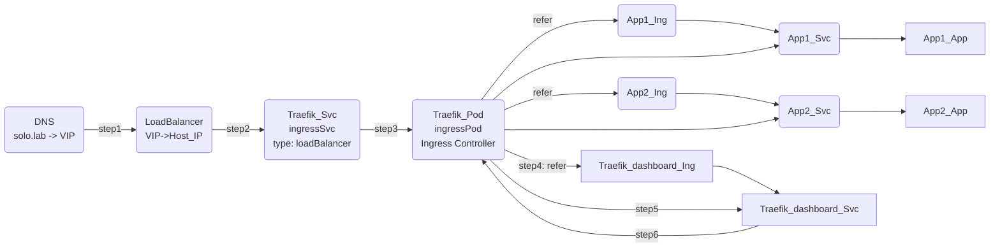
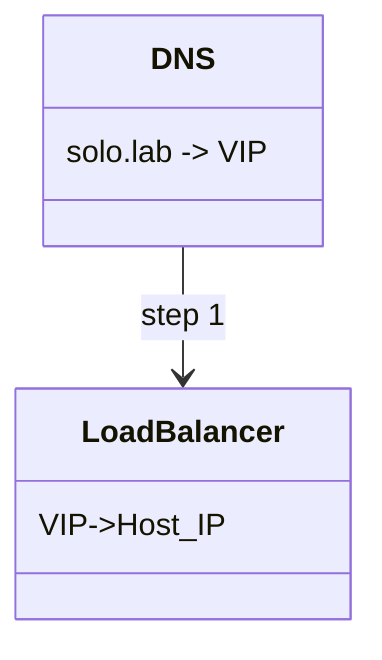
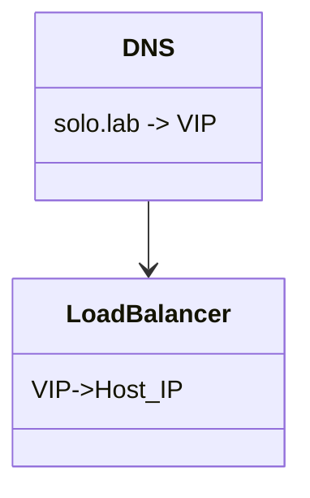

```mermaid
classDiagram
    %%DNS --> LoadBalancer
    %%LoadBalancer --> "Host" Traefik_Svc
    Traefik_Svc --> Traefik_Pod
    Traefik_Pod <--> Traefik_dashboard_Ing
    Traefik_Pod <--> App1_Ing
    Traefik_Pod <--> App2_Ing
    Traefik_Pod --> Traefik_dashboard_Svc
    Traefik_dashboard_Svc --> Traefik_Pod
    Traefik_dashboard_Ing --> Traefik_dashboard_Svc
    Traefik_Pod --> App1_Svc
    App1_Ing --> App1_Svc
    Traefik_Pod --> App2_Svc
    App1_Svc --> App1_Pod
    App2_Ing --> App2_Svc
    App2_Svc --> App2_Pod

    %%DNS : solo.lab -> VIP
    %%LoadBalancer : VIP->Host_IP
    Traefik_Svc : ingressSvc 
    Traefik_Svc:type(loadBalancer)
    Traefik_Pod : ingressPod
    Traefik_Pod:(ingress_controller)
    Traefik_dashboard_Ing : traefik-dashboard
    Traefik_dashboard_Ing : host(solo.lab)
    Traefik_dashboard_Ing : backend_name(traefik-dashboard)
    Traefik_dashboard_Ing : backend_port(9000)
    Traefik_dashboard_Svc : traefik-dashboard
    Traefik_dashboard_Svc : port(9000)
    Traefik_dashboard_Svc : targetPort(traefik)
    Traefik_dashboard_Svc : protocol(tcp)
```

```mermaid
classDiagram
    %%DNS --> LoadBalancer : step 1
    %%LoadBalancer --> "Host" Traefik_Svc : step 2
    Traefik_Svc --> Traefik_Pod : step 3
    Traefik_Pod <--> Traefik_dashboard_Ing : refer(step4)
    Traefik_Pod <--> App1_Ing : refer
    Traefik_Pod <--> App2_Ing : refer
    Traefik_Pod --> Traefik_dashboard_Svc : step5
    Traefik_dashboard_Svc --> Traefik_Pod : step6
    Traefik_dashboard_Ing --> Traefik_dashboard_Svc
    Traefik_Pod --> App1_Svc
    App1_Ing --> App1_Svc
    Traefik_Pod --> App2_Svc
    App1_Svc --> App1_Pod
    App2_Ing --> App2_Svc
    App2_Svc --> App2_Pod

    %%DNS : solo.lab -> VIP
    %%LoadBalancer : VIP->Host_IP
    Traefik_Svc : ingressSvc 
    Traefik_Svc:type(loadBalancer)
    Traefik_Pod : ingressPod
    Traefik_Pod:(ingress_controller)
    Traefik_dashboard_Ing : traefik-dashboard
    Traefik_dashboard_Ing : host(solo.lab)
    Traefik_dashboard_Ing : backend_name(traefik-dashboard)
    Traefik_dashboard_Ing : backend_port(9000)
    Traefik_dashboard_Svc : traefik-dashboard
    Traefik_dashboard_Svc : port(9000)
    Traefik_dashboard_Svc : targetPort(traefik)
    Traefik_dashboard_Svc : protocol(tcp)
```