Kubernetes
介绍与体验
===

### 主讲人
Windom
<br>


---

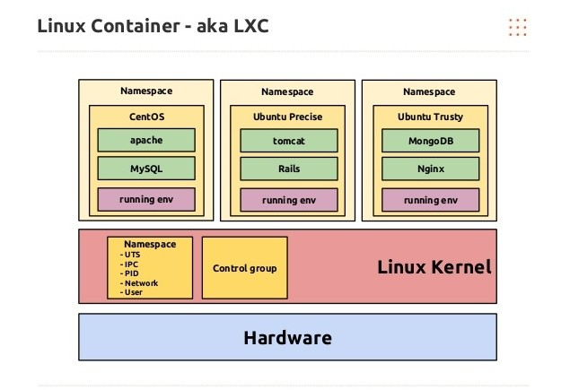
- Kubernetes 是什么？
  - [Kubernetes 又名 K8s，是容器管理和编排的平台](https://kubernetes.io/zh/docs/concepts/overview/what-is-kubernetes/)
  
<br>

- 容器是什么？
  - 容器是一组与系统其余部分隔离的一个或多个进程。  
  - [什么是 Linux 容器？](https://www.redhat.com/zh/topics/containers/whats-a-linux-container) 
  
<br>

- 为何要使用容器？
  两个字 - 灵活


---
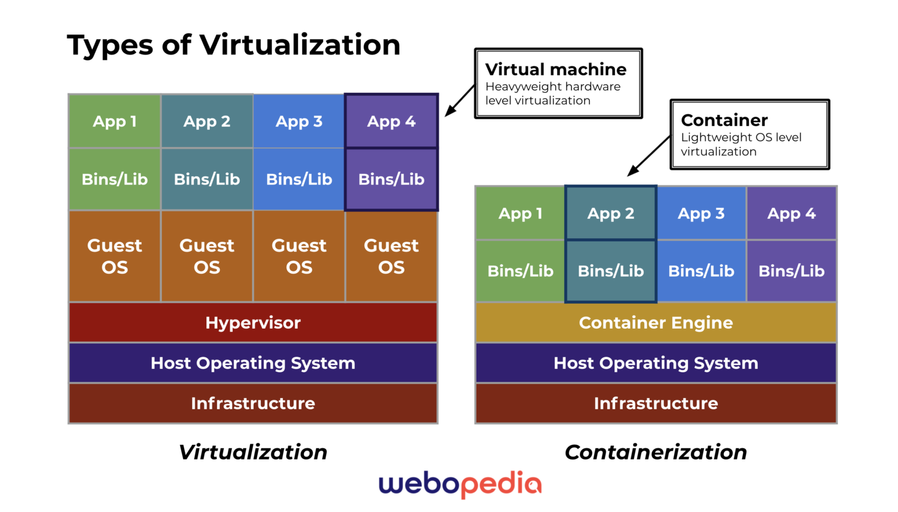
- 容器？虚拟机？
  - 容器：共享内核，无虚拟化层，更低的开销
  - 虚拟机：独立内核，有虚拟化层，更广泛的用途
  - Ref: [Understanding Docker](https://www.containerlabs.kubedaily.com/Docker/Overview/Understanding_Docker.html)  
  
  <br>
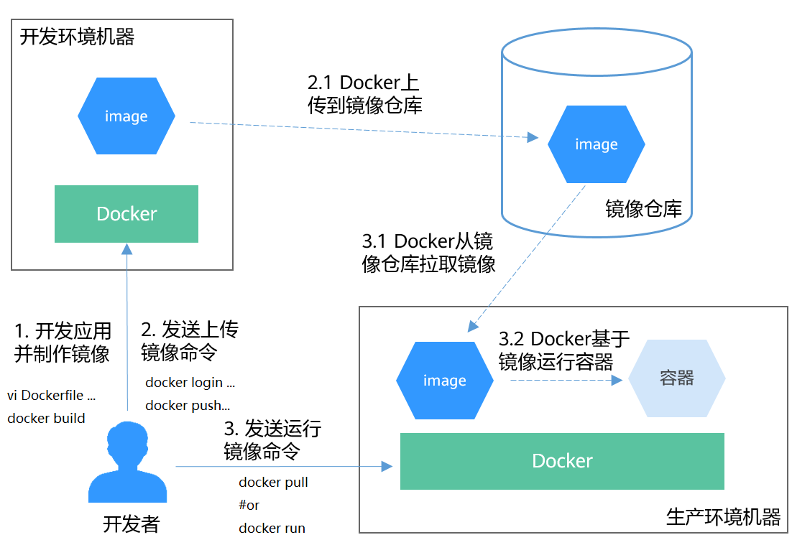
- docker 如何工作？
  - docker → dockerd → containerd → runC → unshare syscall
  - Ref: [Docker是怎样运行的 - 对namespace的介绍](https://www.bilibili.com/video/BV1JZ4y1m7Pv)
  - 


---
<style scoped>
section ul li {
    font-size: 20px;
}
</style>
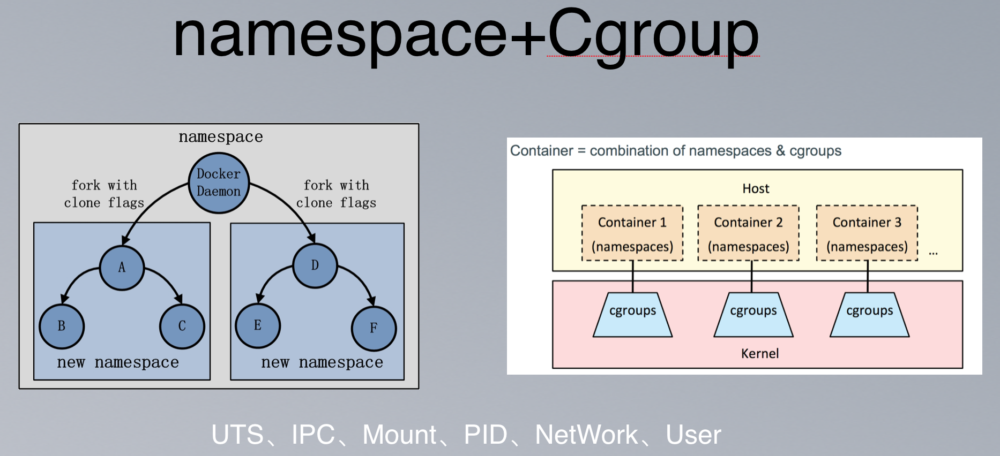
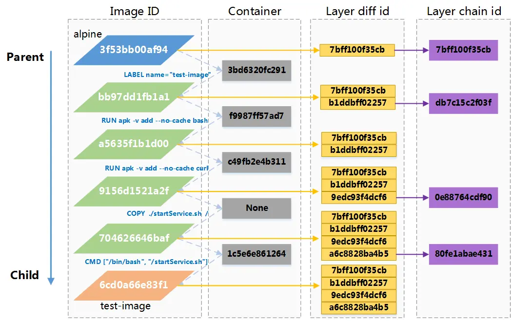
- 容器技术的底层技术（如何实现）？
  - Linux内核提供namespace完成隔离 <- 容器能用什么资源
  - Cgroup完成资源限制 <- 容器能用多少资源
  - rootfs容器文件系统层技术，层：用于描述文件系统的变化 <- 在容器里如何组织文件
  - namespace + Cgroup + rootfs构成了容器的底层技术。
  - Ref:
    - [Docker底层基石namespace与cgroup](https://www.cnblogs.com/janeysj/p/11274515.html)
     
    - [Docker学习：Image的本地存储结构](https://segmentfault.com/a/1190000017579626)
      

---
- Why K8s?
  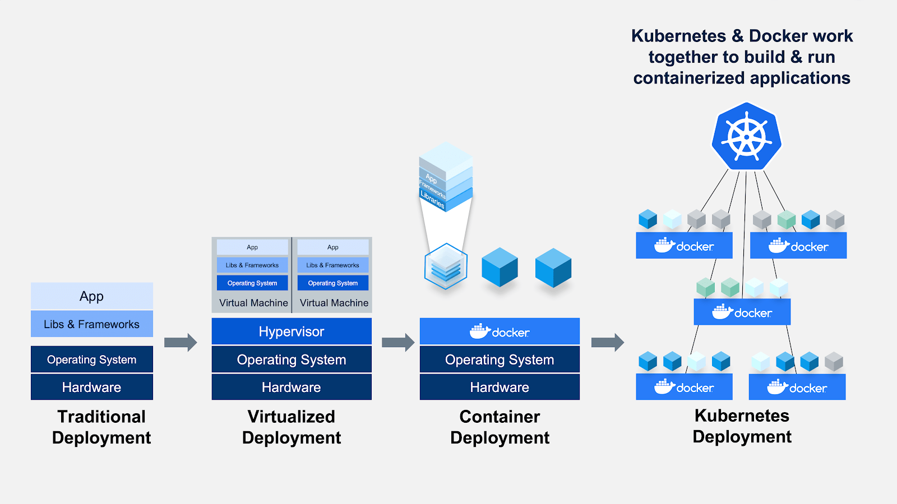

---
<style scoped>
  section ul li {
    font-size: 19px;
}
</style>
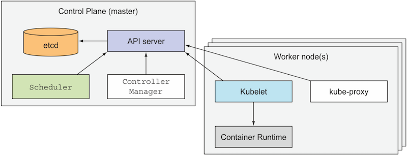
- Q: K8s 有哪些部件？
  - etcd: 基于Raft一致性协议的key/value分布式存储，存储k8s的数据和状  态信息。
  - Controller Manager: 内置了多种控制器（DeploymentController、  ServiceController、NodeController等），集群内部的管理控制中心，负责维护集群的状态，比如故障检测、自动扩展、滚动更新等。
  - Scheduler: 监听apiserver，发现有待调度的Pod，则按照配置的调度策 略绑定到合适的Node上，并把绑定信息写入到etcd。
  - API Server: 提供了Kubernetes中各种对象（Pod, Deployment,  Service等）的Restful接口，Kubernetes中各个组件的通信枢纽。
  - Kubelet: 负责Node节点上Pod生命周期管理，包括Pod的创建、销毁、容器 监控数据采集、Node状态同步等。
  - Kube-proxy: Node节点上的服务网络代理，通过apiserver取到 Service、Endpoint等对象信息，根据配置的方式完成服务的反向代理及负载  均衡。
  - Container Runtime: 底层的容器实现方案，可能是dockerd、containerd, runc等。

---
<style scoped>
  section {
    font-size: 18px;
}
</style>
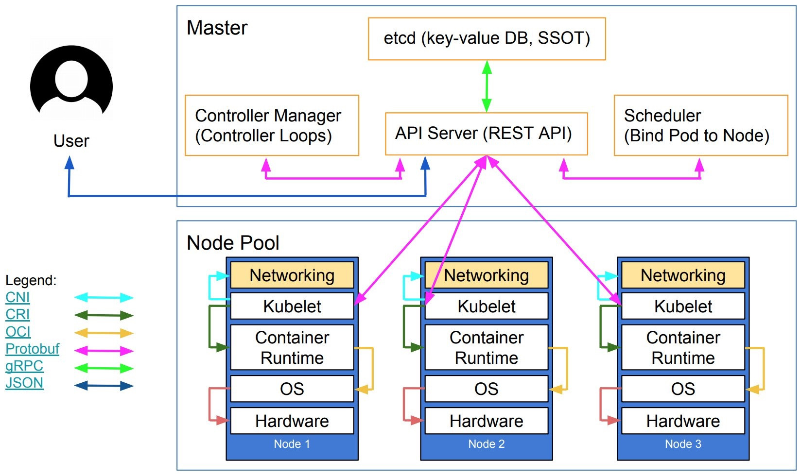
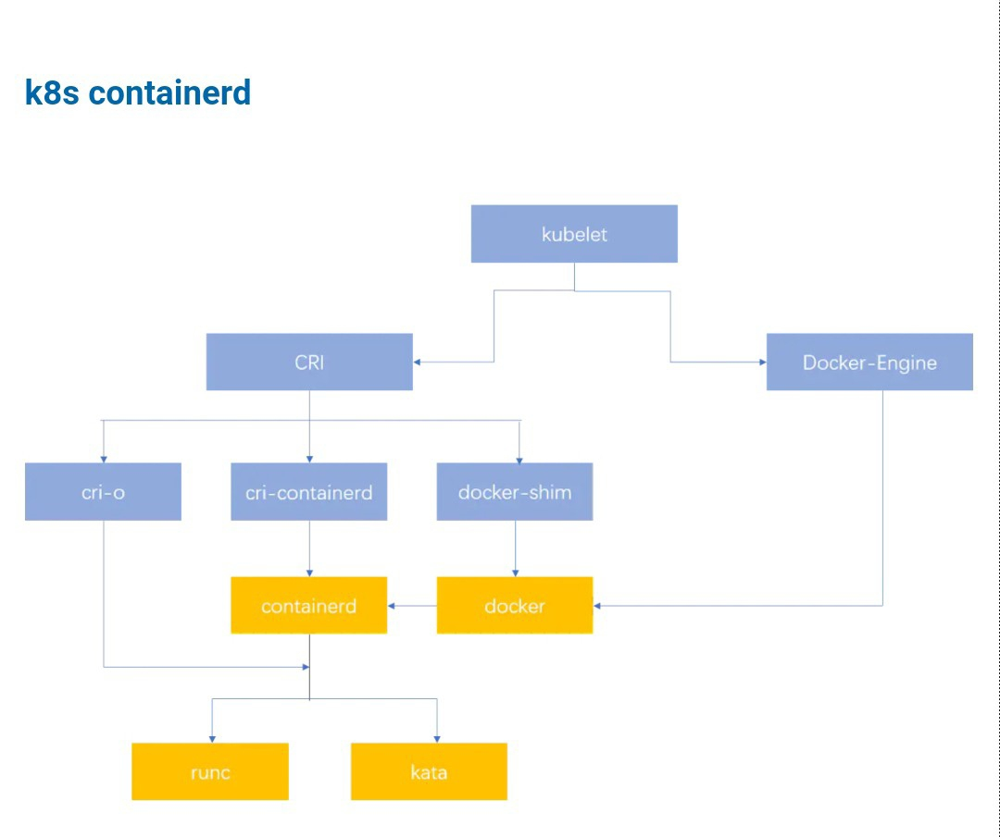
- 说人话
1. Kubectl -> API server -> etcd: 把<对象>做成<想要的状态>
2. Kubectl <- API server <- etcd: 收到
3. controller manager (每隔几秒) -> API server -> etcd: 啥情况
4. controller manager <- API server <- etcd: <对象><当前状态>，做成<想要的状态>
5. controller manager -> API server -> etcd: <对象><当前状态>，做成<想要的状态>，要做<动作>
6. scheduler (每隔几秒) -> API server -> etcd: 啥情况
7. scheduler <- API server <- etcd: <对象><当前状态>，做成<想要的状态>，要做<动作>
8. scheduler -> API server -> etcd: <对象><当前状态>，做成<想要的状态>，要做<动作>，到<节点>做
9. <节点>kubelet -> API server -> etcd: 啥情况
10. <节点>kubelet <- API server <- etcd: <对象><当前状态>，做成<想要的状态>，要做<动作>，到<节点>做
11. <节点>kubelet -> <节点>CRI/Docker: 开搞
12. <节点>kubelet -> API server -> etcd: <对象><当前状态>，做成<想要的状态>，要做<动作>，到<节点>做，<结果(搞完了/搞砸了)>
  
---
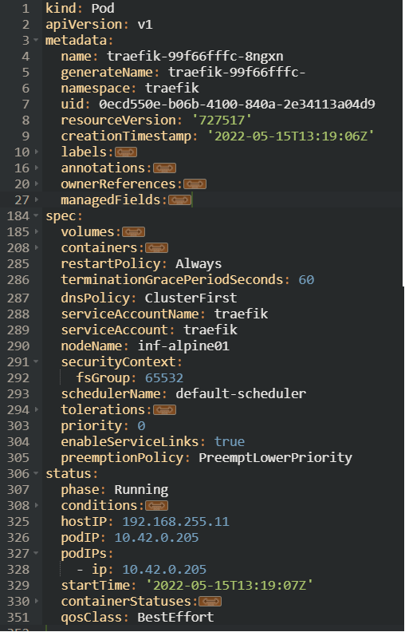
- k8s常用资源描述方式

  - 对象规约（Spec）与状态（Status）
  - etcd中存储了大量的kubernetes对象，这些对象的格式很类似，每个Kubernetes对象包含两个嵌套的对象字段，它们负责管理对象的配置：对象spec和对象status。 
  - spec是必需的，它描述了对象的 期望状态（Desired State） —— 希望对象所具有的特征。 
  - status描述了对象的 实际状态（Actual State） ，它是由 Kubernetes 系统提供和更新的。在任何时刻，Kubernetes 控制面一直努力地管理着对象的实际状态以与期望状态相匹配。

---
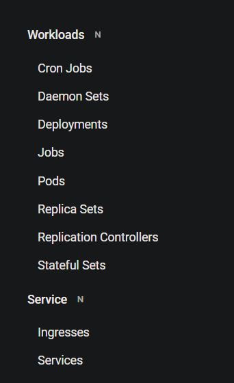
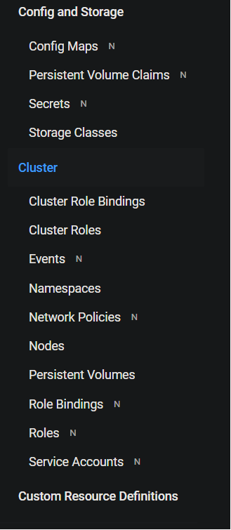
- K8s常用对象
  - 常用的对象分类有以下几种：
  - workload类：工作负载类，包括：pod、deployment、statefulset、daemonset、job
  - discovery&loadbalance类：与服务相关，包括：service、endpoint、ingress
  - config&storage类：应用初始化配置相关，包括：configmap、secret、persistentVolumeClaim
  - cluster类：集群类对象，包括：Node、namespace、persitenceVolume、serviceAccount、clusterRole、ClusterRoleVindeing、ResoruceQuota
  - CRD类：第三方开发的类
---
<!-- _class: invert -->
<style scoped>
  section {
    font-size: 19px;
}
</style>
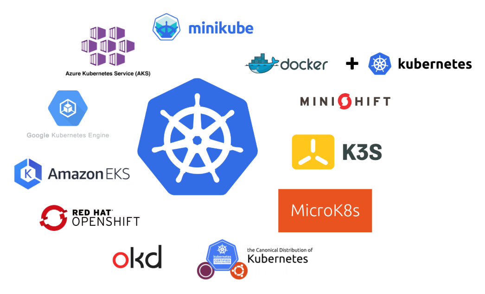
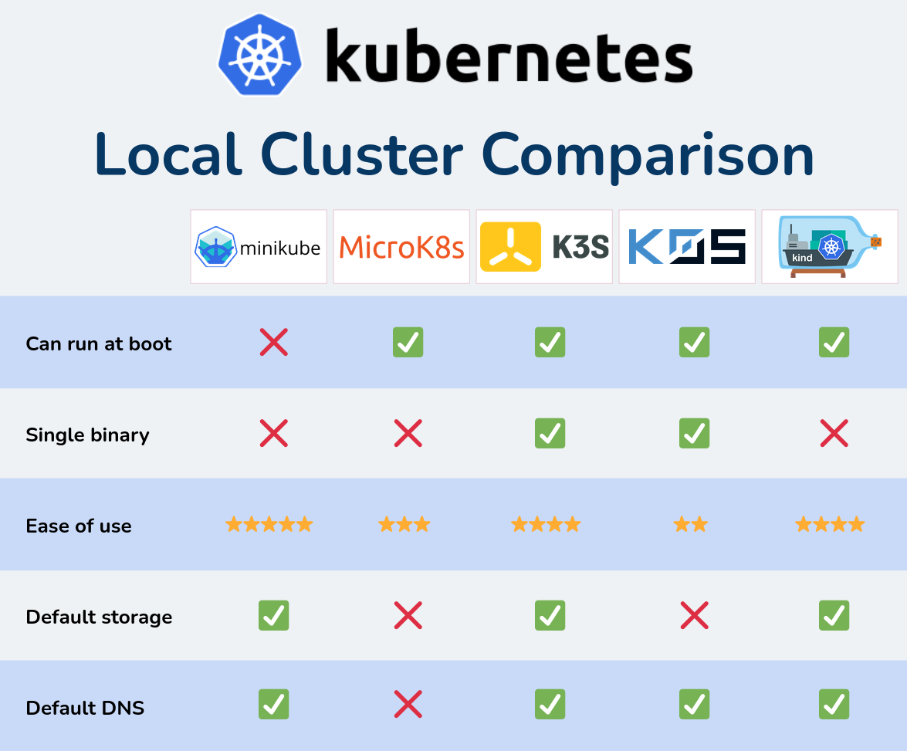
## 常见的K8S发行版(可本地部署)
| 发行版 | 组织 | 备注 |
|:-:|:-:|:-:|
| k8s | google | 原版 |
| openshift | Red Hat | 商业版 |
| okd | Red Hat | openshift社区版 |
| rke2 | SUSE Rancher | 免费使用，提供付费服务 |
| Tanzu | VMWARE | 商业版 |
| TCE | VMWARE | Tanzu社区版 |
| kubesphere | 青云 | 免费使用 |
| k3s | SUSE Rancher | 免费使用，轻量级 |
| microk8s | Canonical | 免费使用，轻量级 |
| k0s | Mirantis | 免费使用，轻量级 |


---

## Page Directives

The page directive would apply to the  **current page and the following pages**.
You should insert it *at the top* to apply it to all slides.

### `page_number`

Set `true` to show page number on slides. *See lower right!*

```html
<!-- page_number: true -->
```

<!--
page_number: true

Example is here. Pagination starts from this page.
If you use multi-line comment, directives should write to each new lines.
-->

---

### `template`

Set to use template of theme.

The `template` directive just enables that using theme supports templates.

```html
<!--
$theme: gaia
template: invert
-->

Example: Set "invert" template of Gaia theme.
```

---

### `footer`

Add a footer to the current slide and all of the following slides

```html
<!-- footer: This is a footer -->
```

Example: Adds "This is a footer" in the bottom of each slide

---

### `prerender`

Pre-renders a slide, which can prevent issues with very large background images.

```html
<!-- prerender: true -->
```

---

## Pro Tips

#### Apply page directive to current slide only

Page directive can be selectively applied to the current slide by prefixing the page directive with `*`.

```
<!-- *page_number: false -->
<!-- *template: invert -->
```

<!--
*page_number: false

Example is here.
Page number is not shown in current page, but it's shown on later pages.
-->

---

#### Slide background Images

You can set an image as a slide background.

```html

```

Options can be provided after `bg`, for example ``.

Options include:

- `original` to include the image without any effects
- `x%` to include the  image at `x` percent of the slide size

Include multiple`` tags to stack background images horizontally.


---

#### Maths Typsetting

Mathematics is typeset using the `KaTeX` package. Use `$` for inline maths, such as $ax^2+bc+c$, and `$$` for block maths:

$$I_{xx}=\int\int_Ry^2f(x,y)\cdot{}dydx$$

```html
This is inline: $ax^2+bx+c$, and this is block:

$$I_{xx}=\int\int_Ry^2f(x,y)\cdot{}dydx$$

```

---

## Enjoy writing slides! :+1:

### https://github.com/yhatt/marp

Copyright &copy; 2016 [Yuki Hattori](https://github.com/yhatt)
This software released under the [MIT License](https://github.com/yhatt/marp/blob/master/LICENSE).