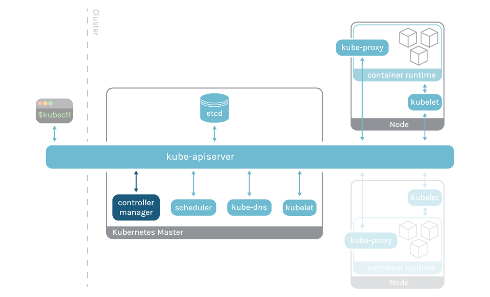

Kubernetes
介绍与体验
===

### 主讲人
Windom
<br>


---
- Q: Kubernetes 是什么？
- A: Kubernetes 又名 K8s，是容器编排平台
<br>

- Q: 容器是什么？
- A: 容器是一组与系统其余部分隔离的一个或多个进程。  
  - Ref: 
    - [什么是 Linux 容器？](https://www.redhat.com/zh/topics/containers/whats-a-linux-container) 
<br>

- Q: 为何要使用容器？
- A: 做到一次打包，（任何宿主系统(Linux)）皆可运行
<br>

---
- Q: docker 如何工作？
- A: docker → dockerd → containerd → runC → unshare syscall    
  - Ref:
    - [Docker是怎样运行的 - 对namespace的介绍](https://www.bilibili.com/video/BV1JZ4y1m7Pv) 
    - 

---
- Q: 容器？虚拟机？
- A: 容器：共享内核，无虚拟化层，更低的开销
     虚拟机：独立内核，有虚拟化层，更广泛的用途
  

---
- Q: Why K8s?
- A: 

---
- Q: K8s 如何工作？
- A: 
  

---
- Q: 说人话
- A: 
1. Kubectl -> API server -> etcd: 把<对象>做成<想要的状态>
2. Kubectl <- API server <- etcd: 收到
3. controller manager (每隔几秒) -> API server -> etcd: 啥情况
4. controller manager <- API server <- etcd: <对象><当前状态>，做成<想要的状态>
5. controller manager -> API server -> etcd: <对象><当前状态>，做成<想要的状态>，要做<动作>
6. scheduler (每隔几秒) -> API server -> etcd: 啥情况
7. scheduler <- API server <- etcd: <对象><当前状态>，做成<想要的状态>，要做<动作>
8. scheduler -> API server -> etcd: <对象><当前状态>，做成<想要的状态>，要做<动作>，到<节点>做
9. <节点>kubelet -> API server -> etcd: 啥情况
10. <节点>kubelet <- API server <- etcd: <对象><当前状态>，做成<想要的状态>，要做<动作>，到<节点>做
11. <节点>kubelet -> <节点>CRI/Docker: 开搞
  
---


12. <节点>kubelet -> API server -> etcd: <对象><当前状态>，做成<想要的状态>，要做<动作>，到<节点>做，<结果(搞完了/搞砸了)>

---

## Global Directives

### `$theme`

Changes the theme of all the slides in the deck. You can also change from `View -> Theme` menu.

```
<!-- $theme: gaia -->
```

|Theme name|Value|Directive|
|:-:|:-:|:-|
|***Default***|default|`<!-- $theme: default -->`
|**Gaia**|gaia|`<!-- $theme: gaia -->`


---

### `$width` / `$height`

Changes width and height of all the slides.

You can use units: `px` (default), `cm`, `mm`, `in`, `pt`, and `pc`.

```html
<!-- $width: 12in -->
```

### `$size`

Changes slide size by presets.

Presets: `4:3`, `16:9`, `A0`-`A8`, `B0`-`B8` and suffix of `-portrait`.

```html
<!-- $size: 16:9 -->
```

<!--
$size: a4

Example is here. Global Directive is enabled in anywhere.
It apply the latest value if you write multiple same Global Directives.
-->

---

## Page Directives

The page directive would apply to the  **current page and the following pages**.
You should insert it *at the top* to apply it to all slides.

### `page_number`

Set `true` to show page number on slides. *See lower right!*

```html
<!-- page_number: true -->
```

<!--
page_number: true

Example is here. Pagination starts from this page.
If you use multi-line comment, directives should write to each new lines.
-->

---

### `template`

Set to use template of theme.

The `template` directive just enables that using theme supports templates.

```html
<!--
$theme: gaia
template: invert
-->

Example: Set "invert" template of Gaia theme.
```

---

### `footer`

Add a footer to the current slide and all of the following slides

```html
<!-- footer: This is a footer -->
```

Example: Adds "This is a footer" in the bottom of each slide

---

### `prerender`

Pre-renders a slide, which can prevent issues with very large background images.

```html
<!-- prerender: true -->
```

---

## Pro Tips

#### Apply page directive to current slide only

Page directive can be selectively applied to the current slide by prefixing the page directive with `*`.

```
<!-- *page_number: false -->
<!-- *template: invert -->
```

<!--
*page_number: false

Example is here.
Page number is not shown in current page, but it's shown on later pages.
-->

---

#### Slide background Images

You can set an image as a slide background.

```html

```

Options can be provided after `bg`, for example ``.

Options include:

- `original` to include the image without any effects
- `x%` to include the  image at `x` percent of the slide size

Include multiple`` tags to stack background images horizontally.


---

#### Maths Typsetting

Mathematics is typeset using the `KaTeX` package. Use `$` for inline maths, such as $ax^2+bc+c$, and `$$` for block maths:

$$I_{xx}=\int\int_Ry^2f(x,y)\cdot{}dydx$$

```html
This is inline: $ax^2+bx+c$, and this is block:

$$I_{xx}=\int\int_Ry^2f(x,y)\cdot{}dydx$$

```

---

## Enjoy writing slides! :+1:

### https://github.com/yhatt/marp

Copyright &copy; 2016 [Yuki Hattori](https://github.com/yhatt)
This software released under the [MIT License](https://github.com/yhatt/marp/blob/master/LICENSE).