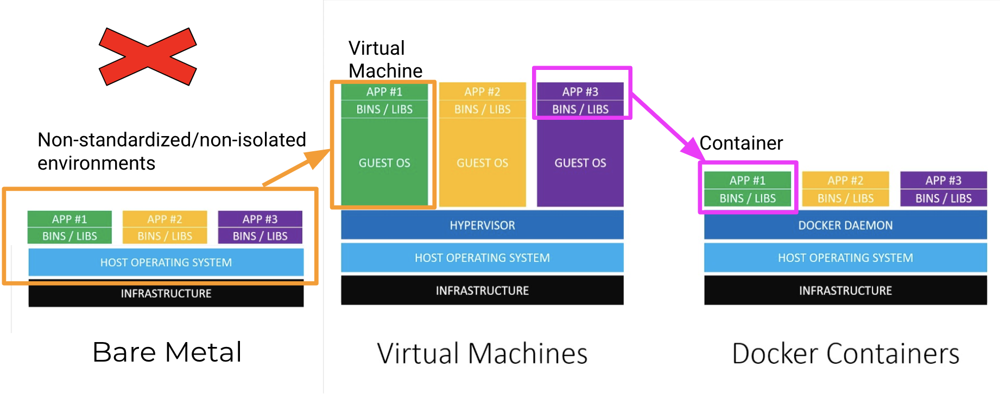
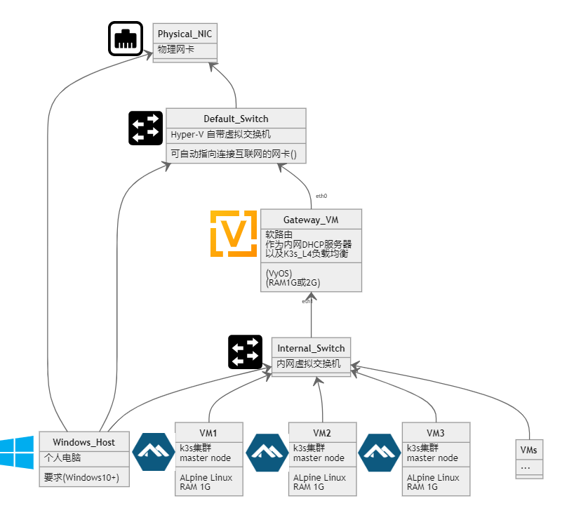

Kubernetes
介绍与体验
===

### 主讲人
Windom
 

---
## 目录:
- [Kubernetes 是什么？](#Kubernetes-是什么)
- [容器是什么？](#容器是什么？)
  - 容器 vs 虚拟机
  - 容器的底层技术
  - docker 基本用法
  - 容器的文件系统
- [K8s简介](#K8S简介)
  - K8s常用对象
  - K8s部件及工作方式
  - K8s常见的发行版
- [K8s集群架构案例](#K8s/K3s集群架构)
  - 在自己的电脑搭建k8s集群

---
## Kubernetes 是什么
  - [Kubernetes 又名 K8s，是容器管理和编排的平台](https://kubernetes.io/zh/docs/concepts/overview/what-is-kubernetes/)  
  
<!--  -->

<!-- 应用出问题-> 重装 -> 重装麻烦 -> 虚拟化 -> 占资源 -> 容器 -->
---
## Why K8s?  
  

---

- 容器？虚拟机？
  - 容器：共享内核，无虚拟化层，更低的开销
   
  - 虚拟机：独立内核，有虚拟化层，更广泛的用途，安全性更高
   
  - 容器与虚拟机通常共存
  <!-- 真实实践上，容器和虚拟机相互配合工作，部署方式更灵活，
       容器技术主要构筑在Linux系统上，其他非Linux系统(Windows, MacOS)如需使用容器，
       则需要在虚拟机上运行，但即便是Linux，在虚拟机上部署容器也有好处，虚拟机安全性更好-->

---

## 容器是什么？
  - 容器是一组与系统其余部分隔离的一个或多个进程。  
    - Ref: 
      - [什么是 Linux 容器？](https://www.redhat.com/zh/topics/containers/whats-a-linux-container) 
        

- 容器技术的底层技术（如何实现）？
  - Linux内核提供namespace完成隔离 <- 容器能用什么资源
  - Cgroup完成资源限制 <- 容器能用多少资源
  - Ref: 
    - [Docker是怎样运行的 - 对namespace的介绍](https://www.bilibili.com/video/BV1JZ4y1m7Pv)  
      

<!-- 这句话如何理解，说白了，所谓的容器，本质上就是一个进程，这个进程的神奇之处在于，它使用的资源是和系统其他进程是隔离开的，互不影响 -->
<!-- 命名空间，实现隔离的效果
 -->

---

- docker 基本用法
  <!-- - docker → dockerd → containerd → runC → unshare syscall
  - Ref:  -->
  

 

- 容器的文件系统
  - rootfs容器文件系统层技术，层：用于描述文件系统的变化 <- 在容器里如何组织文件
  - namespace + Cgroup + rootfs构成了容器的底层技术。

  - Ref: 
    - [Docker学习：Image的本地存储结构](https://segmentfault.com/a/1190000017579626)
      
    - [docker(5): 层](https://www.zsythink.net/archives/4345)  
      

---
## K8S简介
- K8S 常用对象

  <!-- - K8s常用对象
    - 常用的对象分类有以下几种：
    - workload类：工作负载类，包括：pod、deployment、statefulset、daemonset、job
    - discovery&loadbalance类：与服务相关，包括：service、endpoint、ingress
    - config&storage类：应用初始化配置相关，包括：configmap、secret、persistentVolumeClaim
    - cluster类：集群类对象，包括：Node、namespace、persitenceVolume、serviceAccount、clusterRole、ClusterRoleVindeing、ResoruceQuota
    - CRD类：第三方开发的类 -->

---
- k8s常用对象描述方式

  - 对象规约（Spec）与状态（Status）
  - etcd中存储了大量的kubernetes对象，这些对象的格式很类似，每个Kubernetes对象包含两个嵌套的对象字段，它们负责管理对象的配置：对象spec和对象status。 
  - spec是必需的，它描述了对象的 期望状态（Desired State） —— 希望对象所具有的特征。 
  - status描述了对象的 实际状态（Actual State） ，它是由 Kubernetes 系统提供和更新的。在任何时刻，Kubernetes 控制面一直努力地管理着对象的实际状态以与期望状态相匹配。

---

- K8s 部件及工作方式

  <!-- - etcd: 基于Raft一致性协议的key/value分布式存储，存储k8s的数据和状  态信息。
  - Controller Manager: 内置了多种控制器（DeploymentController、  ServiceController、NodeController等），集群内部的管理控制中心，负责维护集群的状态，比如故障检测、自动扩展、滚动更新等。
  - Scheduler: 监听apiserver，发现有待调度的Pod，则按照配置的调度策 略绑定到合适的Node上，并把绑定信息写入到etcd。
  - API Server: 提供了Kubernetes中各种对象（Pod, Deployment,  Service等）的Restful接口，Kubernetes中各个组件的通信枢纽。
  - Kubelet: 负责Node节点上Pod生命周期管理，包括Pod的创建、销毁、容器 监控数据采集、Node状态同步等。
  - Kube-proxy: Node节点上的服务网络代理，通过apiserver取到 Service、Endpoint等对象信息，根据配置的方式完成服务的反向代理及负载  均衡。
  - Container Runtime: 底层的容器实现方案，可能是dockerd、containerd, runc等。 -->

<!-- ---

- 说人话
1. Kubectl (user) -> API server -> etcd: 把<对象>做成<想要的状态>
2. Kubectl (user) <- API server <- etcd: 收到
3. controller manager (每隔几秒) -> API server -> etcd: 啥情况
4. controller manager <- API server <- etcd: <对象><当前状态>，做成<想要的状态>
5. controller manager -> API server -> etcd: <对象><当前状态>，做成<想要的状态>，要做<动作>
6. scheduler (每隔几秒) -> API server -> etcd: 啥情况
7. scheduler <- API server <- etcd: <对象><当前状态>，做成<想要的状态>，要做<动作>
8. scheduler -> API server -> etcd: <对象><当前状态>，做成<想要的状态>，要做<动作>，到<节点>做
9. <节点>kubelet -> API server -> etcd: 啥情况
10. <节点>kubelet <- API server <- etcd: <对象><当前状态>，做成<想要的状态>，要做<动作>，到<节点>做
11. <节点>kubelet -> <节点>CRI/Docker: 开搞
12. <节点>kubelet -> API server -> etcd: <对象><当前状态>，做成<想要的状态>，要做<动作>，到<节点>做，<结果(搞完了/搞砸了)>

   -->

---

## 常见的K8S发行版(可本地部署)
| 发行版 | 组织 | 备注 |
|:-:|:-:|:-:|
| k8s | google | 原版 |
| openshift | Red Hat | 商业版 |
| okd | Red Hat | openshift社区版 |
| rke2 | SUSE Rancher | 免费使用，提供付费服务 |
| Tanzu | VMWARE | 商业版 |
| TCE | VMWARE | Tanzu社区版 |
| kubesphere | 青云 | 免费使用 |
| k3s | SUSE Rancher | 免费使用，轻量级 |
| microk8s | Canonical | 免费使用，轻量级 |
| k0s | Mirantis | 免费使用，轻量级 |

---
## K8s/K3s集群架构
- 高可用集群
  硬件要求
  - 内存：最低16G，建议32G
  
 

- 单管理平面节点集群
  硬件要求
  - 内存：建议16G
  

---
## 本案

<!--  -->

---

## 开搞
详参：https://github.com/fsdrw08/SoloLab

---

## Ingress 原理

<!--  -->
