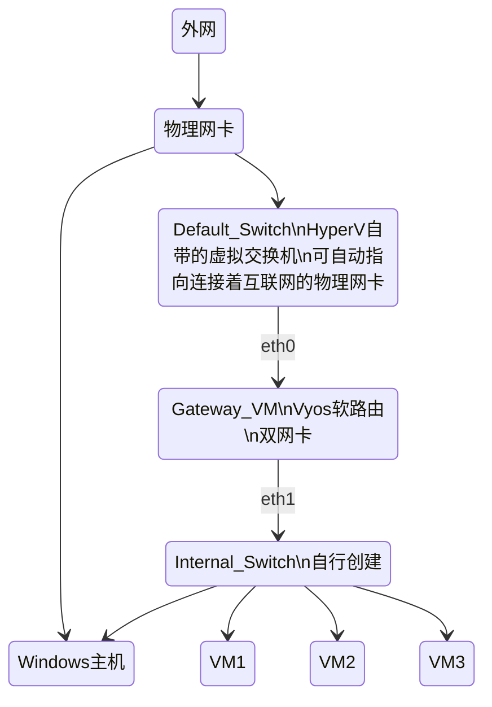

```mermaid
classDiagram
    %%internet <-- Physical_NIC
    Physical_NIC <-- Windows_Host
    Physical_NIC <-- Default_Switch
    Default_Switch <-- "eth0" Gateway_VM
    Default_Switch <-- Windows_Host
    Gateway_VM "eth1" <-- Internal_Switch
    Internal_Switch <-- Windows_Host
    Internal_Switch <-- VM1
    Internal_Switch <-- VM2
    Internal_Switch <-- VM3
    Internal_Switch <-- VM3
    Internal_Switch <-- VMs

    %%internet : 外网
    Physical_NIC : 物理网卡

    Default_Switch : Hyper-V 自带虚拟交换机
    Default_Switch: .可自动指向连接互联网的网卡()

    Windows_Host : 个人电脑
    Windows_Host: .要求(Windows10+)

    Gateway_VM : 软路由
    Gateway_VM : 作为内网DHCP服务器
    Gateway_VM : 以及K3s_L4负载均衡
    Gateway_VM: (VyOS)
    Gateway_VM: (RAM1G或2G)

    Internal_Switch : 内网虚拟交换机

    VM1 : k3s集群
    VM1 : master node
    VM1: (ALpine Linux)
    VM1: (RAM 1G)
    VM2 : k3s集群 
    VM2 : master node
    VM2: (ALpine Linux)
    VM2: (RAM 1G)
    VM3 : k3s集群
    VM3 : master node
    VM3: (ALpine Linux)
    VM3: (RAM 1G)
    VMs : ...
```
<br>
<br>
<br>
<br>

